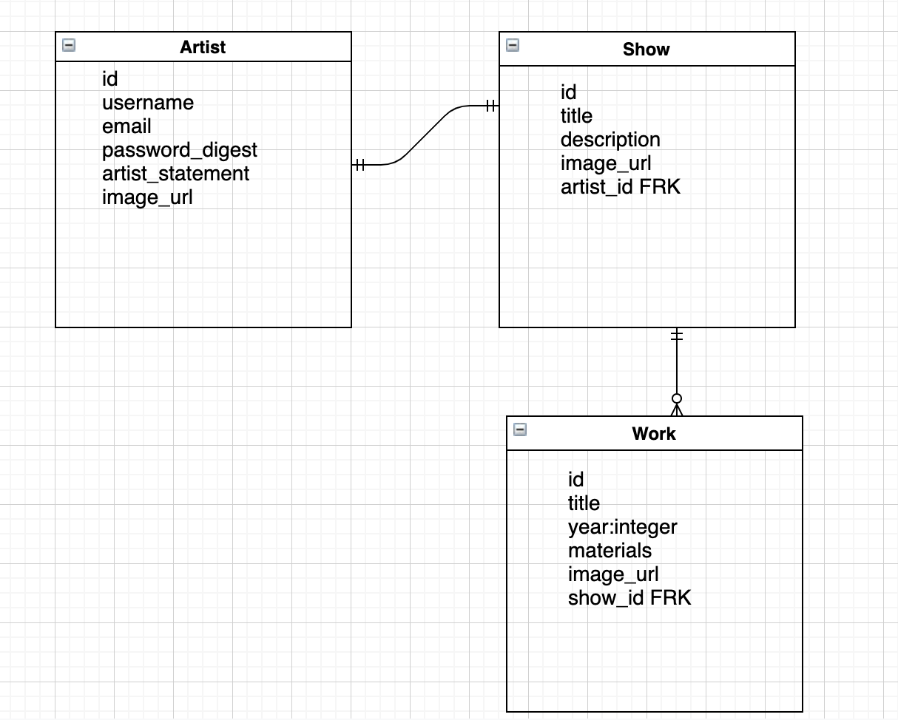

# Art-Space

## About

Art-Space is an online arts application that allows visual artists to organize galleries to share their work in curated virtual shows.

## MVP
### Libraries & Frameworks

|     Library/Framework      | Description                                |
| :--------------: | :----------------------------------------- |
|      React       | Client-side components to manage user interaction |
|    React Router  | Manage navigation between screens  |
| CSS | Styling |
| axios | API requests |
| bcrypt | User authentication |
|    Ruby on Rails      | Back-end database interactions |
|  Postgresql   | Database |

### Client

#### Wireframes

#### Component Hierarchy
[link to component hierarchy](https://whimsical.com/component-hierarchy-P6BsaCVmLKW1wdZxSgwQo5)

#### Component File Structure
[component-file-structure](assets/component-file-structure1.png)

#### Timetable

| Task                | Priority | Estimated Time | Time Invested | Actual Time |
| ------------------- | :------: | :------------: | :-----------: | :---------: |
| create DB tables and models    |    H     |     1 hr      |           |    TBD    |
| back-end CRUD  |    H     |     3 hrs      |         |     TBD     |
| back-end testing/debugging  |    H     |     2 hr      |         |     TBD     |
| React components  |    H     |     4 hrs      |         |     TBD     |
| front-end CRUD/services  |    H     |     4 hrs      |         |     TBD     |
| front-end testing/debugging  |    H     |     3 hrs      |         |     TBD     |
| user authentication   https://whimsical.com/art-space-wireframes-17J8J1xS97fcNQd9cPTukc|    H     |     3 hrs      |         |     TBD     |
| CSS styling: artists views  |    H     |     3 hrs      |         |     TBD     |
| CSS styling: visitor views  |    H     |     3 hrs      |         |     TBD     |
| Post-MVP gallery expansion  |    L     |     2 hrs      |         |     TBD     |
| Post-MVP tracker, comment features   |    L     |     2 hrs      |         |     TBD     |
| TOTAL               |          |     30 hrs      |        |     TBD     |

### Server
### ERD

## Post-MVP
- Allow artists to create multiple galleries to represent individual shows and archive past shows.
- Create an Artist home page that groups actions available to artists.
- Create an additional screen for Artist Profile separate from Show.
- Create a comment function to allow visitors to leave comments on works or shows.

